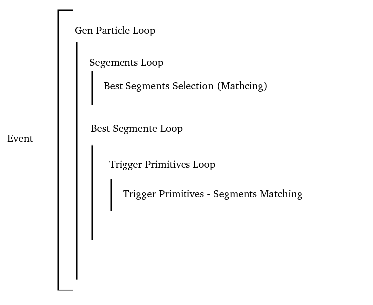

# Super Trigger Primitives DT + RPC


Scripts to calculate the trigger primitive efficiency.

The most important file is ```DTNtupleTPGSimAnalyzer_Efficiency.cpp```.

It is based on the official DT efficiency script: https://github.com/jaimeleonh/DTNtuples/blob/unifiedPerf/test/DTNtupleTPGSimAnalyzer_Efficiency.C

## Code Logic 




## Run Script

The files used as input can be found in this link: https://ragomesd.web.cern.ch/RPC_DT/dtntuples/step2/

You run the ```DTNtupleTPGSimAnalyzer_Efficiency.cpp``` script locally with

```
root -l -b -q DTNtupleTPGSimAnalyzer_Efficiency.cpp++
```

```-l```: Do not show the ROOT banner

```-b```: Run in batch mode without graphics

```-q```: Exit after processing command line macro files

```++```: To compile the script

I am using pre-compiled binary distribution ROOT 6.34.00. If you need more information access this adress: https://root.cern/install/

## Folders

In the folder ```Doutput/noRPCoutput/noRPC``` you can see the control plots.

In the folder ```DTNtupleTPGSimAnalyzer_Efficiency/eff``` you can see the efficiency plots.