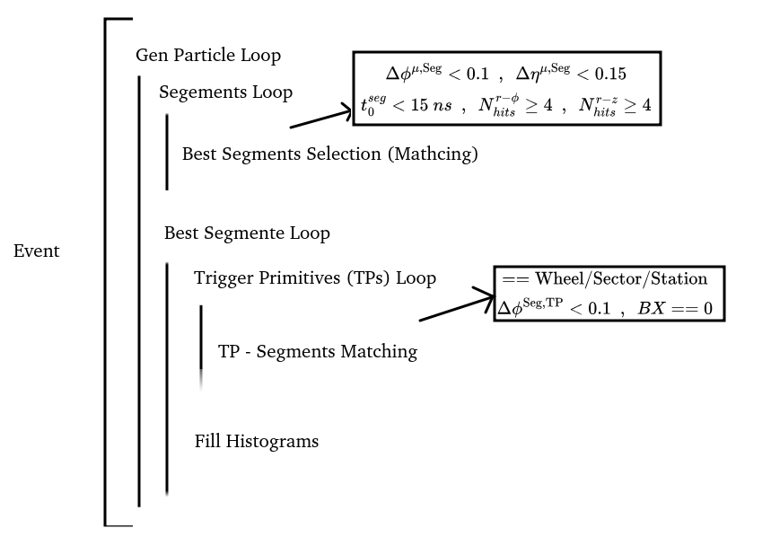

# Super Trigger Primitives DT + RPC

Scripts to calculate the trigger primitive efficiency and produce plots

It is based on the official DT efficiency script: https://github.com/jaimeleonh/DTNtuples/blob/unifiedPerf/test/DTNtupleTPGSimAnalyzer_Efficiency.C

## Code Logic 




## Run Script

The files used as input can be found in this link: https://ragomesd.web.cern.ch/RPC_DT/dtntuples/step2/

You run the ```DTNtupleTPGSimAnalyzer_Efficiency.cpp``` script locally with

```
root -l -b -q DTNtupleTPGSimAnalyzer_Efficiency.cpp++
```

```-l```: Do not show the ROOT banner

```-b```: Run in batch mode without graphics

```-q```: Exit after processing command line macro files

```++```: To compile the script


After, you run ```plot_histograms.cpp```.
```
root -l -b -q plot_histograms.cpp++
```

I am using pre-compiled binary distribution ROOT 6.36.000 If you need more information access this adress: https://root.cern/install/

## Importante Folders

After you running the scripts above, you can check the histograms in the ```output``` folder

```output/noRPC/histograms/``` : Control plots.
```output/noRPC/histograms/effPlots/``` : Efficiency plots.
```output/t0/``` : time of the triggers primitives.